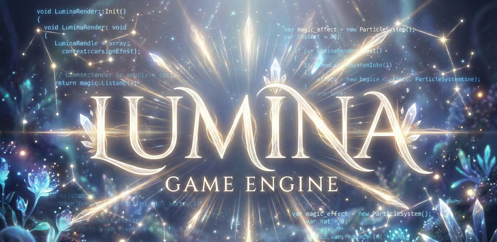

<p align="center">
  
</p>

<h1 align="center">✨ Lumina Engine</h1>

<p align="center">
  <strong>Illuminate Your Game Development</strong><br>
  <em>Motor de Jogo 2D completo com Editor Visual em JavaScript puro</em>
</p>

<p align="center">
  
  
  
  
</p>

<p align="center">
  <a href="README.md">English</a> •
  <a href="README.pt-BR.md">Português (Brasil)</a>
</p>

---

## ✨ Destaques

- 🖼️ **Editor Visual WYSIWYG** - Crie jogos sem programar
- 🧩 **Arquitetura ECS** - Entity-Component-System modular
- 🎨 **Sistema de Partículas** - Com templates reutilizáveis
- 💡 **Iluminação 2D** - Luzes dinâmicas e sombras
- 🗺️ **Tilemap Editor** - Construa mapas visualmente
- 🎬 **Editor de Animações** - Configure sprites e animações
- 📜 **Sistema de Scripts** - Comportamentos customizáveis
- 🎯 **Física 2D** - Colisões, gravidade e plataformas

---

## 🚀 Quick Start

### 1. Clone o Repositório

```bash
git clone https://github.com/uareke/LuminaGameEngine.git
cd LuminaGameEngine
```

### 2. Abra o Editor

Abra `index.html` em um navegador moderno (recomendado: Chrome, Firefox, Edge)

> ⚠️ **Importante**: Use um servidor local para evitar problemas de CORS:
> ```bash
> # Opção 1: Python
> python -m http.server 8000
> 
> # Opção 2: Node.js
> npx http-server
> 
> # Opção 3: VS Code Live Server
> # Instale a extensão "Live Server" e clique com botão direito > "Open with Live Server"
> ```

### 3. Crie Seu Primeiro Jogo

1. **Adicione um Asset**
   - Clique no painel de Assets
   - Upload de uma imagem (sprite)
   - Configure frames e animações

2. **Crie uma Entidade**
   - Clique em `+ Criar` → `Player`
   - Selecione a entidade no canvas

3. **Adicione Componentes**
   - No painel de propriedades: `+ Adicionar Componente`
   - Escolha: `Sprite Renderer`, `Box Collider`, `Script Plataforma`

4. **Teste**
   - Clique em `▶ Play`
   - Use setas para mover, espaço para pular

5. **Salve**
   - `💾 Salvar` para exportar o projeto

---

## 📚 Documentação

### Documentação Completa
- **[📖 Documentação Completa](documentation/GAME_ENGINE_COMPLETA.md)** - Guia completo da engine

### Guias Específicos
- **[🎯 Manual de Uso](documentation/MANUAL_DE_USO.md)** - Como usar o editor
- **[✨ Sistema de Partículas](documentation/PARTICLE_SYSTEM.md)** - Guia de partículas
- **[💡 Sistema de Iluminação](documentation/tecnica/LIGHTING_SYSTEM.md)** - Iluminação 2D
- **[📜 Scripting](documentation/04_scripting.md)** - Criando scripts
- **[🎬 Animações](documentation/03_animacoes.md)** - Sistema de animações

---

## 🏗️ Arquitetura

### Estrutura do Projeto

```
LuminaGameEngine/
├── index.html              # Editor visual
├── main.js                 # Entry point
├── engine/                 # Core da engine
│   ├── Engine.js
│   ├── LoopJogo.js
│   ├── Renderizador.js
│   └── Camera.js
├── componentes/            # Componentes ECS
│   ├── SpriteComponent.js
│   ├── CollisionComponent.js
│   ├── ParticleEmitterComponent.js
│   ├── LightComponent.js
│   └── ...
├── editor/                 # Editor visual
│   ├── EditorPrincipal.js
│   ├── AssetManager.js
│   ├── EditorAnimation.js
│   └── ...
├── sistemas/               # Sistemas especializados
│   └── LightingSystem.js
└── documentation/          # Documentação
```

### Padrão ECS

```javascript
// Entity (Container)
const player = new Entidade('player');

// Components (Dados + Comportamento)
player.adicionarComponente('SpriteComponent', new SpriteComponent());
player.adicionarComponente('CollisionComponent', new CollisionComponent());
player.adicionarComponente('script_movimento', new ScriptComponent());

// Systems (Lógica Global)
// Processam componentes no game loop
```

---

## 🎯 Recursos

### ✅ Implementado

#### Editor
- [x] Interface WYSIWYG completa
- [x] Hierarquia de entidades (tree view)
- [x] Painel de propriedades dinâmico
- [x] Asset manager com preview
- [x] Editor de sprites (fatiar sprite sheets)
- [x] Editor de animações
- [x] Editor de partículas
- [x] Editor de iluminação
- [x] Tilemap painter
- [x] Grid e snap-to-grid
- [x] Gizmos visuais
- [x] Console de debug

#### Engine Core
- [x] Game loop otimizado
- [x] Sistema de renderização 2D
- [x] Câmera com zoom e pan
- [x] Sistema de input (teclado/mouse)
- [x] Delta time preciso
- [x] Serialização/Desserialização

#### Componentes
- [x] **SpriteComponent** - Renderização de sprites
- [x] **CollisionComponent** - Colisões AABB
- [x] **ParticleEmitterComponent** - Sistema de partículas
- [x] **LightComponent** - Iluminação 2D
- [x] **TilemapComponent** - Tilemaps
- [x] **CameraFollowComponent** - Câmera que segue
- [x] **DialogueComponent** - Sistema de diálogos
- [x] **ParallaxComponent** - Fundos parallax
- [x] **ScriptComponent** - Scripts customizados
- [x] **CheckpointComponent** - Checkpoints
- [x] **KillZoneComponent** - Áreas de morte

#### Sistemas
- [x] **Física 2D** - Gravidade, colisões
- [x] **Animações** - Frame-based sprites
- [x] **Partículas** - Sistema completo com templates
- [x] **Iluminação** - Luzes dinâmicas e sombras
- [x] **Tilemap** - Editor e renderização
- [x] **Scripts** - Sistema de scripting

#### Recursos Avançados
- [x] Templates de partículas reutilizáveis
- [x] Presets de iluminação
- [x] Gerador de scripts (movimento, IA, combate)
- [x] One-way platforms
- [x] Triggers (colisores sem física)
- [x] Exportação de projetos (JSON)
- [x] Importação de projetos
- [x] Drag & drop de assets

### 🚧 Roadmap

- [ ] Sistema de som/música
- [ ] Tilemaps com auto-tiling
- [ ] Pathfinding (A*)
- [ ] Shaders customizáveis
- [ ] Visual scripting (nodes)
- [ ] Mobile controls
- [ ] Multiplayer básico
- [ ] Plugin system

---

## 🎨 Exemplos

### Jogo de Plataforma

```javascript
// Player com movimento e física
const player = new Entidade('player');
player.adicionarComponente('SpriteComponent', sprite);
player.adicionarComponente('CollisionComponent', collider);
player.adicionarComponente('script_platform', scriptPlataforma);
player.adicionarComponente('CameraFollowComponent', cameraFollow);
```

### Sistema de Partículas (Fogo)

```javascript
const fogueira = new Entidade('objeto');
const emitter = new ParticleEmitterComponent();
emitter.aplicarPreset('fogo');
emitter.emitindo = true;
fogueira.adicionarComponente('ParticleEmitterComponent', emitter);
```

### NPC com Diálogo

```javascript
const npc = new Entidade('npc');
const dialogue = new DialogueComponent();
dialogue.adicionarDialogo({
    texto: "Bem-vindo à vila!",
    nomePersonagem: "Guardião"
});
npc.adicionarComponente('DialogueComponent', dialogue);
```

Mais exemplos na [documentação completa](documentation/GAME_ENGINE_COMPLETA.md#exemplos-de-uso).

---

## 🛠️ Tecnologias

- **JavaScript ES6+** - Linguagem principal
- **HTML5 Canvas** - Renderização
- **CSS3** - Interface do editor
- **Sem dependências externas** - 100% vanilla

---

## 📖 Tutoriais

### Tutorial 1: Criando um Jogo de Plataforma

1. **Setup Inicial**
   - Crie um novo projeto
   - Upload de sprite do player (32x32px)
   - Configure animações: idle, walk, jump

2. **Player**
   - Crie entidade "Player"
   - Adicione: Sprite, Collision, Script Plataforma
   - Configure velocidade: 200px/s
   - Configure pulo: 400px/s

3. **Cenário**
   - Crie entidade "Tilemap"
   - Adicione TilemapComponent
   - Upload de tileset
   - Pinte o mapa com tiles sólidos

4. **Iluminação**
   - Adicione LightComponent ao player
   - Cor: #ffffff, Raio: 150, Intensidade: 0.8
   - Configure cena: Background escuro

5. **Teste**
   - Play → Teste movimento e pulo
   - Ajuste física se necessário

6. **Salve**
   - Salvar projeto → `plataforma_basico.json`

### Tutorial 2: Sistema de Partículas

1. **Abra Editor de Partículas** (botão ✨)

2. **Crie Template**
   - Nome: "fogo_tocha"
   - Taxa: 30 part/s
   - Cor inicial: #ff6600
   - Cor final: #ff000000
   - Ângulo: 260-280° (para cima)
   - Gravidade: -50

3. **Aplique na Cena**
   - Crie entidade "Tocha"
   - Adicione ParticleEmitterComponent
   - Selecione template "fogo_tocha"
   - Ative "Emitindo"

4. **Adicione Luz**
   - Adicione LightComponent
   - Cor: #ff6600 (mesma do fogo)
   - Intensidade: 0.7

Mais tutoriais no [manual de uso](documentation/MANUAL_DE_USO.md).

---

## 🐛 Troubleshooting

### Assets não carregam

- ✅ Use servidor local (não `file://`)
- ✅ Verifique console para erros CORS
- ✅ Use Base64 para testes rápidos

### Colisões não funcionam

- ✅ Ambas entidades têm CollisionComponent?
- ✅ `largura` e `altura` estão definidos?
- ✅ Colliders não são `isTrigger`?

### Performance ruim

- ✅ Reduza partículas (`maxParticulas`)
- ✅ Desative gizmos no Play
- ✅ Use culling (não renderizar fora da tela)

Mais soluções no [troubleshooting guide](documentation/GAME_ENGINE_COMPLETA.md#troubleshooting).

---

## 🤝 Contribuindo

Contribuições são bem-vindas!

1. Fork o projeto
2. Crie uma branch: `git checkout -b feature/minha-feature`
3. Commit: `git commit -m 'Add: minha feature'`
4. Push: `git push origin feature/minha-feature`
5. Abra um Pull Request

### Diretrizes

- Código em **ES6+**
- Documente funções públicas com **JSDoc**
- Teste antes de submeter
- Siga convenção de nomenclatura existente

---

## 📜 Licença

Este projeto é open source sob a licença MIT.

---

## 🎓 Aprendendo Mais

### Recursos Educacionais

- **[Documentação Completa](documentation/GAME_ENGINE_COMPLETA.md)** - Aprenda tudo sobre a engine
- **[Exemplos de Código](documentation/GAME_ENGINE_COMPLETA.md#exemplos-de-uso)** - Snippets prontos
- **Código Fonte** - Explore e aprenda com o código

### Conceitos Importantes

- **ECS (Entity-Component-System)** - Arquitetura modular
- **Game Loop** - Update → Render
- **Delta Time** - Consistência em qualquer FPS
- **AABB Collision** - Colisões retangulares
- **Sprite Animation** - Frame-based
- **Particle Systems** - Efeitos visuais

---

## 📞 Suporte

- **Bugs**: Abra uma [issue](https://github.com/uareke/LuminaGameEngine/issues)
- **Features**: Sugira no [discussions](https://github.com/uareke/LuminaGameEngine/discussions)
- **Documentação**: Consulte `/documentation`

---

## 🌟 Showcase

Compartilhe seus jogos criados com a engine! Abra uma issue com a tag `showcase`.

---

## 🙏 Agradecimentos

Inspirações:
- **Unity** - Interface e workflow
- **Godot** - Sistema de nós/componentes
- **Phaser.js** - API e estrutura

---

## 📊 Status do Projeto


**Última atualização**: Dezembro 2025  
**Versão**: 2.0  
**Desenvolvedor**: Alex Sandro Martins de Araujo

---

## 🚀 Let's Build Amazing Games!

**Comece agora** abrindo o `index.html` e criando seu primeiro jogo!


> _"Illuminate your creativity, one game at a time"_ ✨

---

**Made with ❤️ using Vanilla JavaScript**

