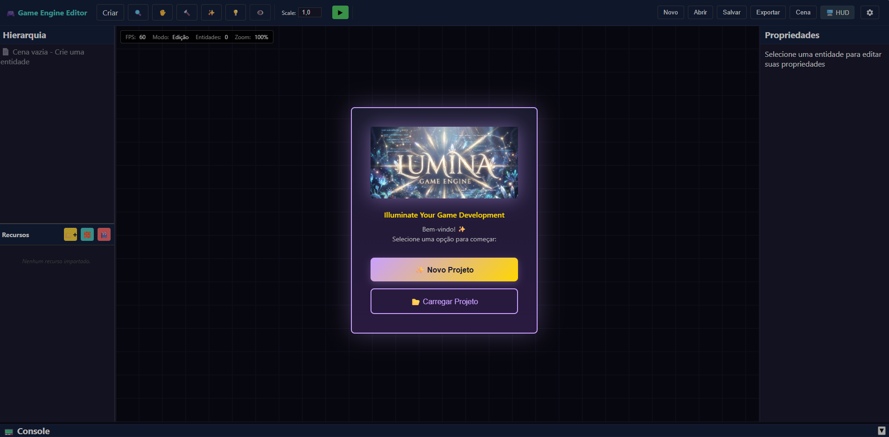
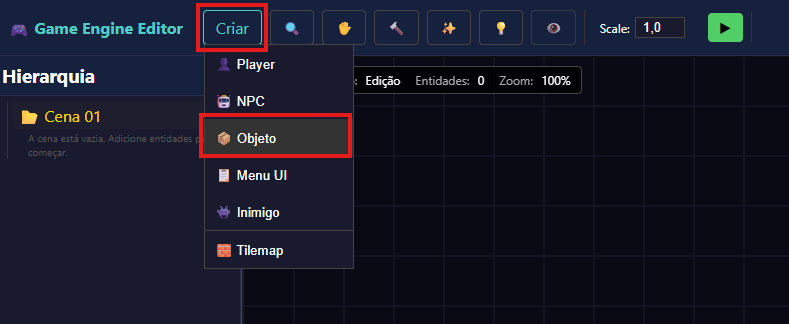
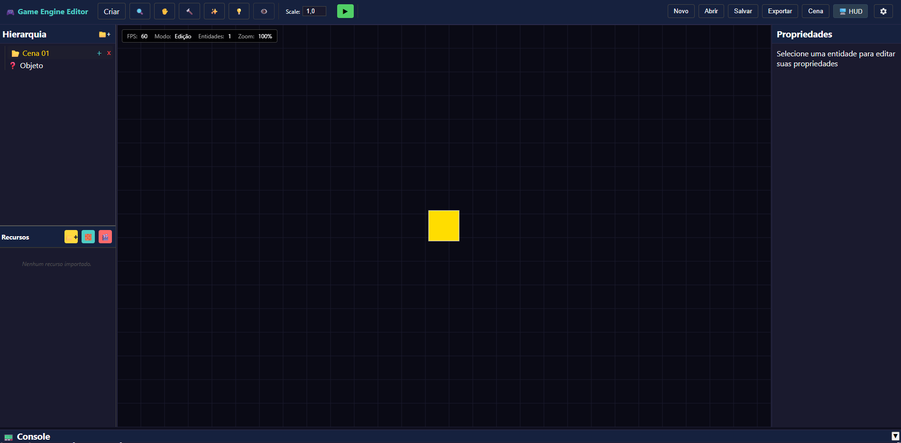
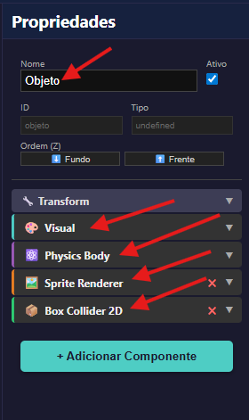
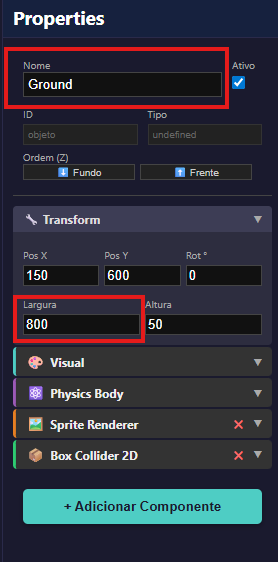
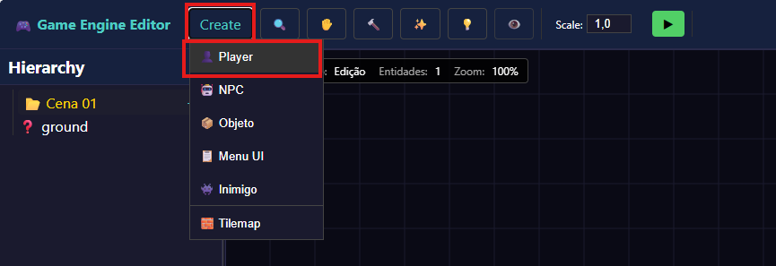
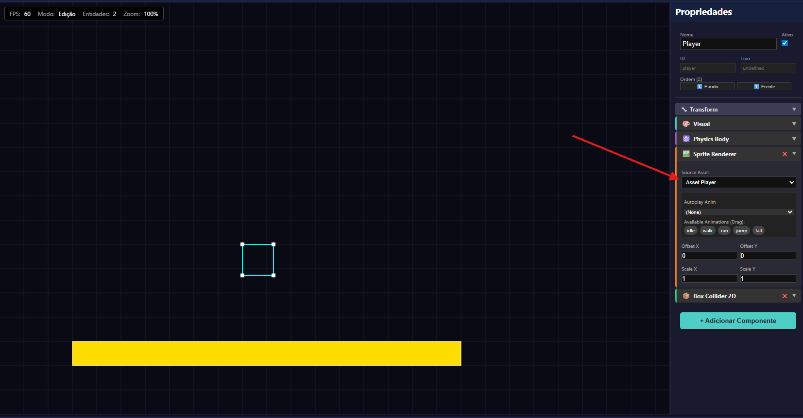
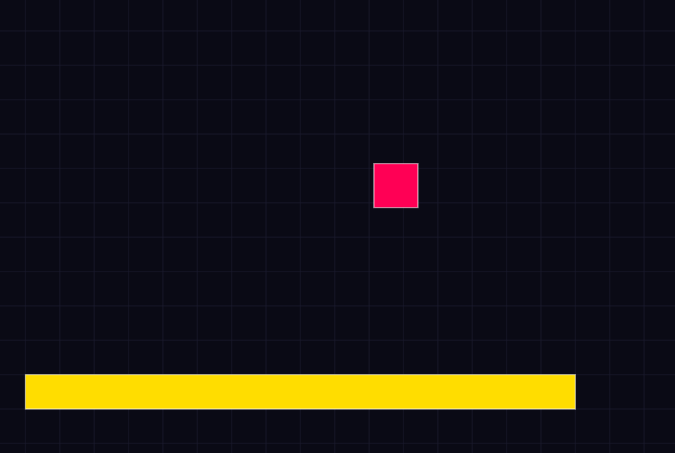
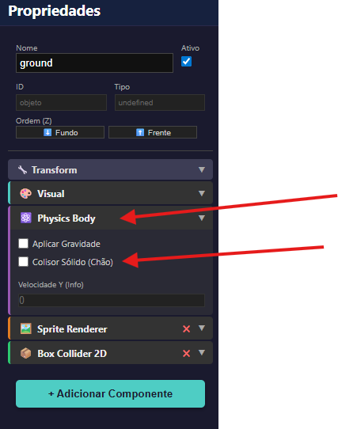

# Tutorial: Criando seu primeiro jogo

### 1. Bem-vindo ao Lumina Engine
Ao abrir o editor pela primeira vez, você verá a tela inicial abaixo:

Aqui você tem duas opções principais:
*   **Novo Projeto:** Para iniciar uma criação do zero.
*   **Carregar Projeto:** Para continuar um trabalho salvo anteriormente.

Para este tutorial, clique em **Novo Projeto**.

---

### 2. Conhecendo a Interface

Antes de começar, vamos entender as áreas fundamentais do editor:

*   🔴 **Área Vermelha (Ferramentas):** Aqui ficam as ferramentas principais de manipulação (Mover, Selecionar, Criar).
*   🔵 **Área Azul (Assets):** É sua biblioteca. Onde você carrega imagens, sons e recursos.
*   🟢 **Área Verde (Hierarquia):** Lista todos os objetos presentes na cena atual (Player, Inimigos, Cenário).
*   🟡 **Área Amarela (Propriedades):** O painel mais importante. Aqui você edita as configurações do objeto selecionado (adiciona scripts, colisores, altera tamanho, etc).

---

### 3. Criando a Cena: O Chão (Ground)

Vamos criar dois objetos essenciais: o chão e o jogador.

1.  Clique no botão de **Adicionar Novo Objeto** (Cubo).

Um quadrado amarelo aparecerá no centro da tela. Este é o seu objeto padrão.

2.  Com o quadrado selecionado, olhe para o **Painel de Propriedades** (Direita).
    Por padrão, ele vem com o nome "Objeto" e configurações básicas.

3.  Vamos configurá-lo para ser nosso chão:
    *   **Nome:** Renomeie para `Ground` (ou Chão).
    *   **Largura (Width):** Altere para `400`.

---

### 4. Criando o Jogador (Player)

Agora vamos adicionar o personagem.

1.  Clique no botão de adicionar **Player** (ícone de pessoa).

*Nota:* Inicialmente, o Player pode aparecer transparente (invisível) pois ainda não criamos animações para ele.

2.  Para visualizá-lo agora:
    *   Nas propriedades do Player, procure por **Source Asset**.
    *   Selecione **"Cor Sólida"** (ou deixe vazio/none dependendo da configuração) para que ele apareça como um quadrado vermelho.

---

### 5. Hora de Testar!

Agora aperte o botão **Play** (▶) no topo do editor e veja o que acontece.

<b>🎬 Ver Vídeo do Resultado</b>

  <!-- Link corrigido para formato embed -->
  <iframe width="800" height="450" src="https://www.youtube.com/embed/9eaa8ssaEao" frameborder="0" allow="accelerometer; autoplay; clipboard-write; encrypted-media; gyroscope; picture-in-picture" allowfullscreen></iframe>

**O problema:** O Player caiu infinitamente através do chão! 😲
**A causa:** O objeto `Ground` visualmente existe, mas ainda não possui física sólida.

---

### 6. Corrigindo a Colisão

Para resolver isso, precisamos dizer à engine que o chão é sólido.

1.  Clique no objeto `Ground` para selecioná-lo.
2.  No painel de Propriedades, procure a seção de **Física/Colisão**.

3.  Marque a opção **Sólido** (Check Solido).

Agora, dê **Play** novamente. O jogador deverá cair e aterrissar perfeitamente sobre o chão. Parabéns, você criou sua primeira física de jogo! 🚀